# RestaurantAdvisor

A desktop Java application for discovering, managing, and reviewing restaurants — built with Swing and backed by a real MariaDB database.

## Features

- **User accounts** — sign up, log in, and recover a forgotten password
- **Profiles** — view and edit your profile (name, username, profile picture), or delete your account
- **Browse restaurants** — see all restaurants in the database, each with a name, address, price point, and image
- **Add your own restaurant** — upload an image, set a name, address, and price point, and it's yours to manage
- **Edit & delete** — restaurant owners can update their restaurant's details or remove it entirely

### Known Limitations
- **Write a Review** — the UI for leaving a star rating and written review is in place, but the backend logic to save it hasn't been implemented yet
- **Rating system** — restaurants have a `rating` field in the schema and UI, but there's no logic to calculate or update it based on reviews yet.

## How It Works

- After logging in (or signing up), you land on **My Profile**, showing your account info and any restaurants you own. From there, you can navigate to the **Restaurants** menu to see every restaurant currently in the database.
- Selecting a restaurant opens its **details view**, showing the owner and a running list of reviews (once implemented). A rating is displayed but isn't currently calculated from real review data.
- From **My Profile**, you can see your account info, upload a profile picture, and manage any restaurants you own — including adding a brand new one.
- Adding a restaurant lets you upload an image, name it, set an address, and choose a price point (Low / Medium / High) — once saved, it immediately appears in the shared restaurant list for everyone to see.
- Forgot your password? The **Forgot Password** screen lets you reset it by username, no email required.

## Tech Stack

- **Java** (Swing, built with NetBeans' GUI Builder)
- **MariaDB** — relational database for users, restaurants, and reviews
- **MariaDB Java Client** (JDBC driver) for the database connection

## Database

The schema has three tables — `users`, `restaurants`, and `reviews` — with restaurants and reviews both linked back to the users who created them. See the full entity-relationship diagram:

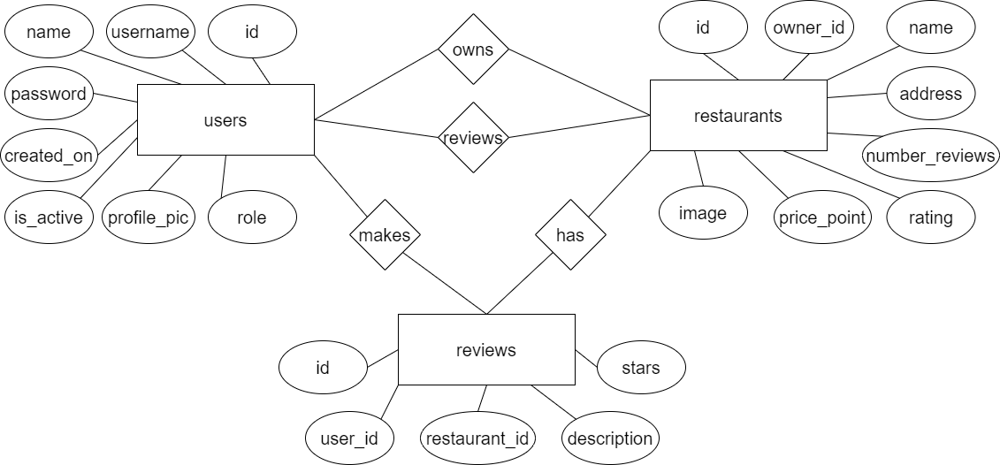

SQL setup scripts are included at `src/bg/smg/sql/create_scripts.sql` (schema) and `insert_scripts.sql` (sample data).

## Working with Images

The app loads restaurant and profile images by filename from a fixed classpath location: `src/resources/restaurant_images/` and `src/resources/profile_images/`. Any image referenced in the database **must** actually exist in that folder.

If you're adding new restaurant or profile images while developing, they need to be placed inside `src/resources/restaurant_images/` or `src/resources/profile_images/` — the app has no concept of loading images from anywhere else on disk.

## Getting Started

### Requirements
- JDK 8+
- An IDE that supports Java (e.g. IntelliJ IDEA or NetBeans)
- MariaDB (or MySQL) Server running locally on port 3306

### Setup
1. Clone the repo and open it in your IDE.
2. Run `src/bg/smg/sql/create_scripts.sql` against your local MariaDB instance to create the database and tables.
3. Run `src/bg/smg/sql/insert_scripts.sql` to seed an admin account and two sample restaurants.
4. Confirm `src/bg/smg/util/DBManager.java` matches your local DB credentials (defaults to user `root`, no password).
5. Run the app starting from `LoginScreen.java`.

### Test login
You can log in with one of the following accounts:
User owns two restaurants:
- **Username:** `john`
- **Password:** `123456`

User owns one restaurant:
- **Username:** `maria`
- **Password:** `123456`

User owns no restaurants:
- **Username:** `julian`
- **Password:** `123456`

## Screenshots

| | |
|---|---|
| **Login** | 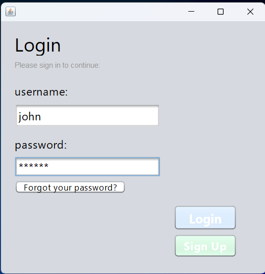 |
| **Sign Up** | 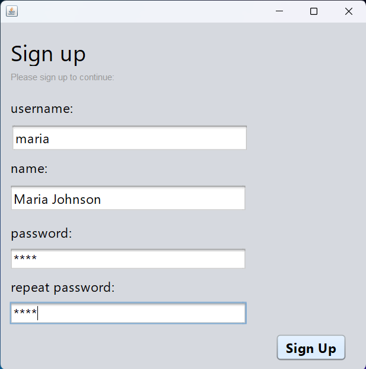 |
| **Forgot Password** | 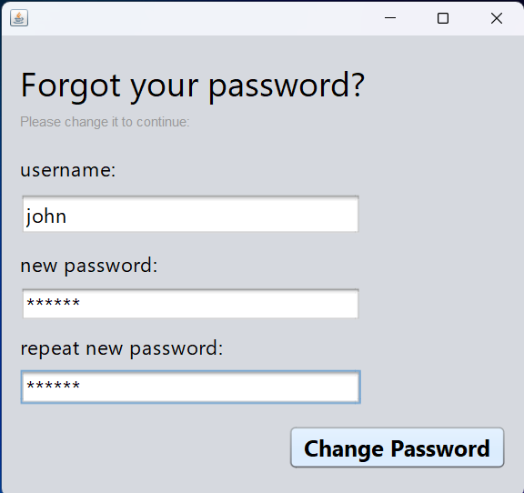 |
| **My Profile** — landing screen after login | 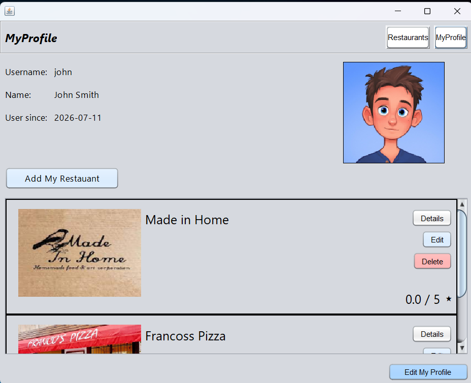 |
| **My Profile** — editing your profile | 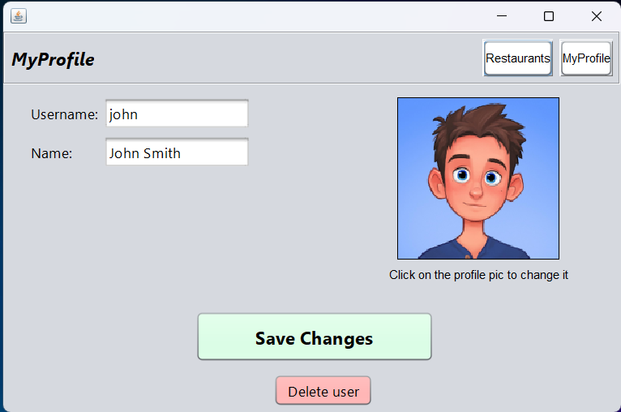 |
| **Restaurants Menu** — browsing all restaurants | 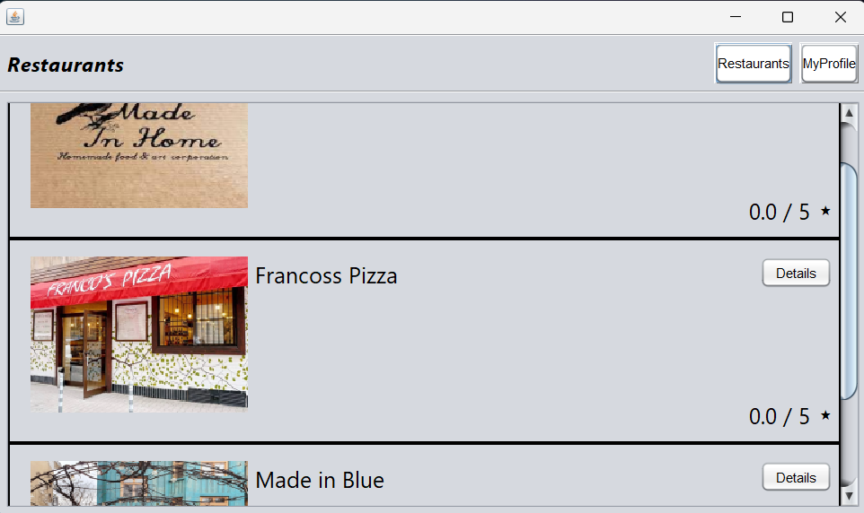 |
| **Adding a New Restaurant** | 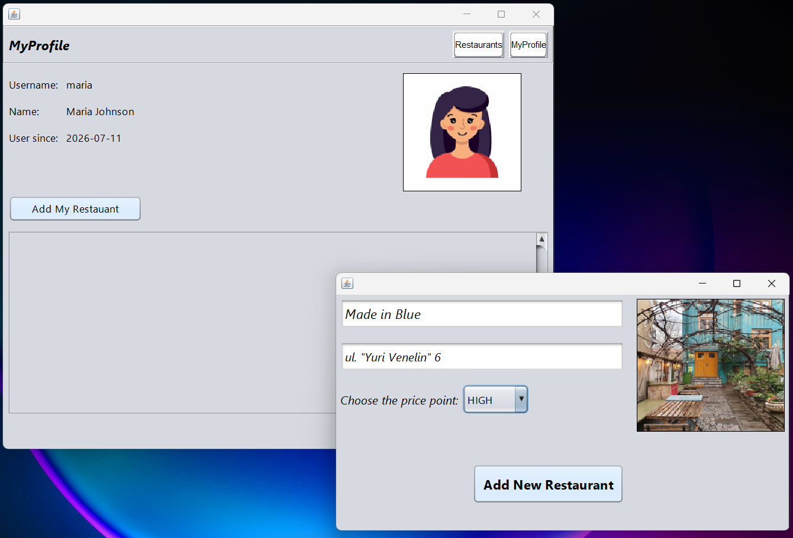 |
| **Restaurant Added** — confirmation | 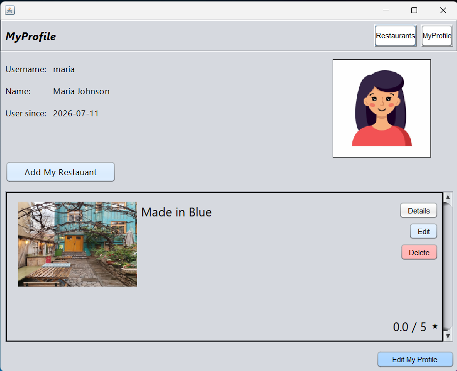 |
| **Restaurant Details** | 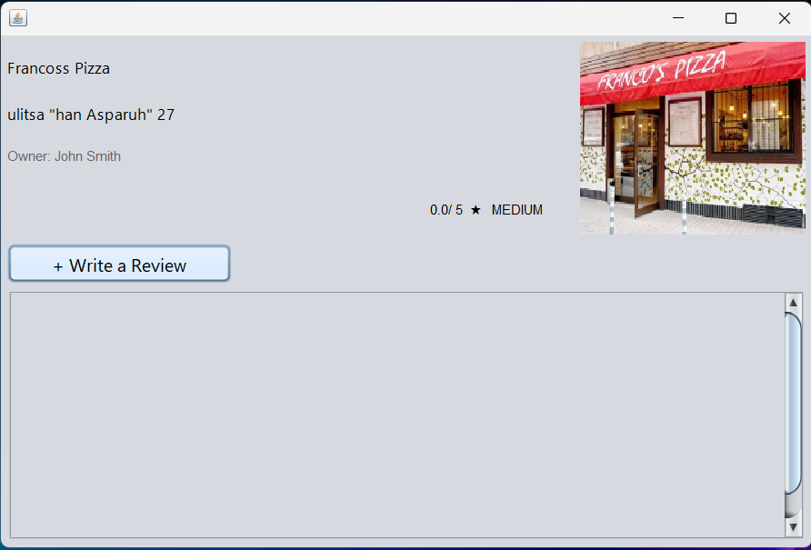 |
| **Editing a Restaurant** | 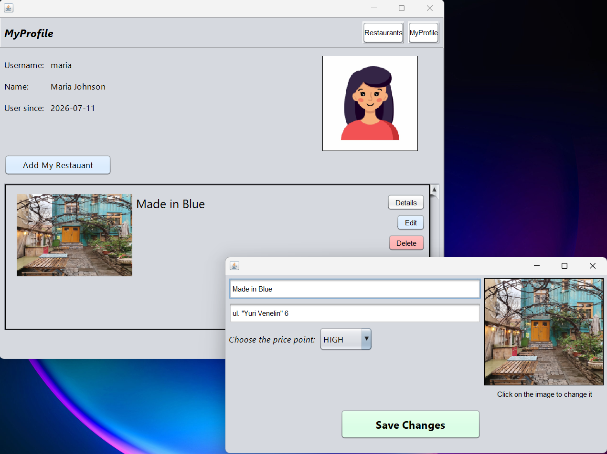 |
| **Deleting a Restaurant** | 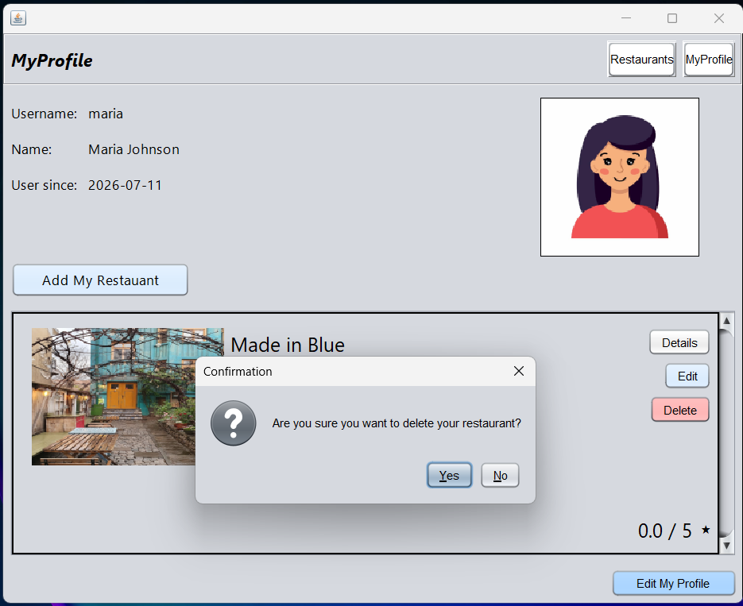 |

## Design

Early UI mockups for each screen are available in the `design/` folder, created before the app was built.